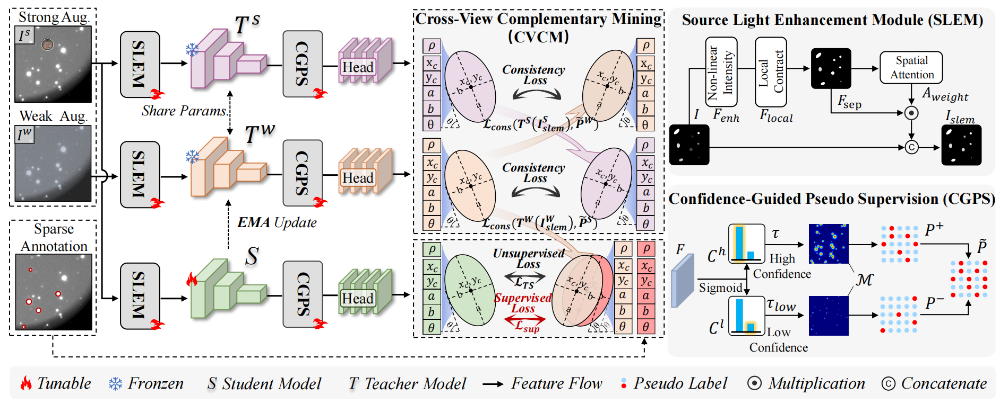

# NovaTeacher
Official code of paper- Semi-supervised Source Detection in Astronomical Images: New Benchmark and Strong Baseline

# Introduction
Source detection in modern observational astronomy is a cornerstone for accurately localizing and identifying stellar sources. It is crucial for studies such as stellar population synthesis and cosmological parameter estimation. However, the characteristics of astronomical images, including high density, the effect of point spread functions and low signal-to-noise ratios, significantly challenge the latest advanced object detectors. 
Besides, fully-supervised detection methods are hardly practical, due to the significant difficulty in annotating dense, small, and faint sources in astronomical images. 
To tackle the scarcity of astronomical datasets, we introduce a new comprehensive benchmark (LAMOST-DET), comprising 18,400 astronomical images and 728,898 source instances.
Upon the dataset, we further devise a novel semi-supervised learning framework coined Nova Teacher, capable of detecting dense sources effectively given sparse annotations. 
It integrates source light enhancement module, confidence-guided pseudo-supervision, and cross-view complementary mining in a dual-teacher paradigm.
Extensive experiments on LAMOST-DET show that, Nova Teacher consistently improves previous competitors by 4.04\% and 5.22\% mAP under two semi-supervised settings.
Additionally, our method competes against other detectors on a natural image dataset, validating its generalization ability to various scenarios.




# Training
Code and Config are now available. You could train NovaTeacher with the following command:
```
sh train.sh
```
Or train the supervised baseline via configs in `./configs/ssad_fcos/`.


## Acknowledgement
Many thanks to the brilliant works ([SOOD]( https://github.com/HamPerdredes/SOOD))!


